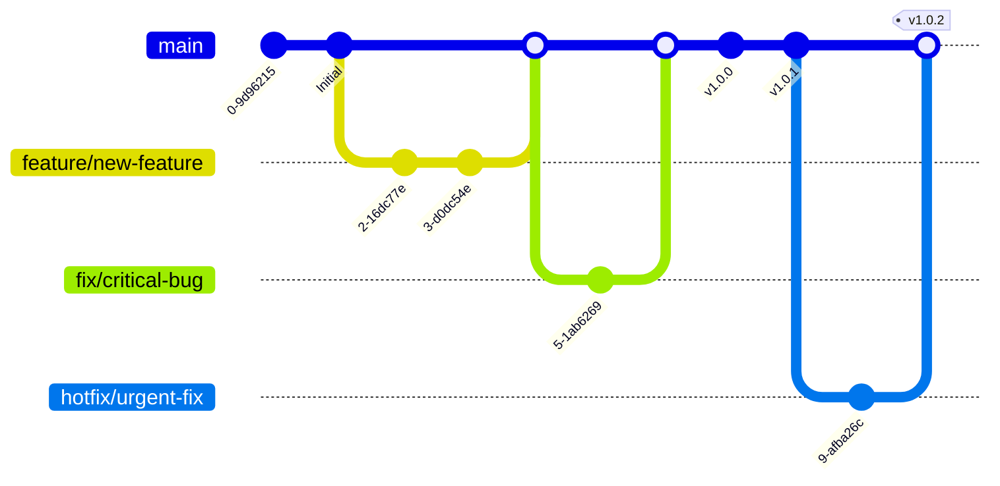
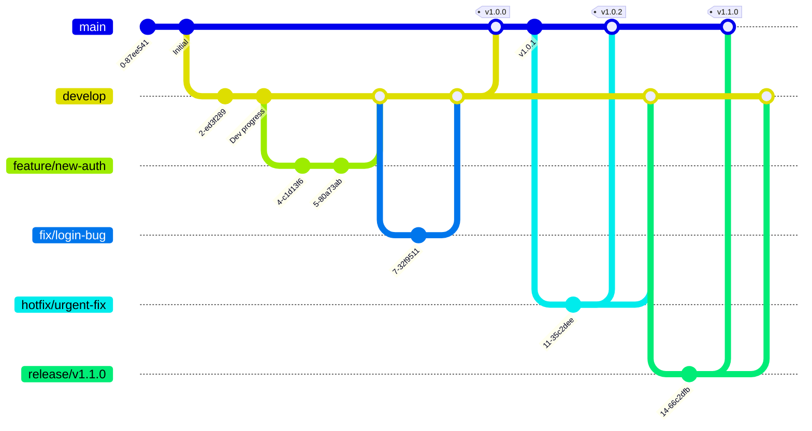

# Git Branching Strategy

## Overview
GitFlow-inspired branching strategy for this project. Solo development omits the `develop` branch.

## Branch Types

| Branch | Purpose | Optional |
|--------|---------|----------|
| `main` | Production codebase | No |
| `develop` | Integration for team development | Yes (solo: skip) |
| `feature/*` | New features | No |
| `fix/*` | Bug fixes | No |
| `hotfix/*` | Urgent production fixes | No |
| `release/*` | Release preparation | Yes |

## Branch Naming Rules

- Features: `feature/<descriptive-name>`
  - Examples: `feature/user-authentication`, `feature/dark-mode`

- Fixes: `fix/<descriptive-name>`
  - Examples: `fix/login-error`, `fix/memory-leak`

- Hotfixes: `hotfix/<descriptive-name>`
  - Examples: `hotfix/security-patch`, `hotfix/critical-bug`

- Releases: `release/<version>`
  - Examples: `release/v1.0.0`, `release/v2.1.0`

## Workflow

### Creating Feature Branch
```bash
# From main (solo or team)
git checkout main
git pull origin main
git checkout -b feature/your-feature-name

# OR from develop (team only)
git checkout develop
git pull origin develop
git checkout -b feature/your-feature-name
```

### Creating Hotfix Branch

```bash
# Always from main (production)
git checkout main
git pull origin main
git checkout -b hotfix/urgent-fix-description
```

### Merging Hotfix

```bash
# 1. Merge to main and tag release
git checkout main
git merge hotfix/urgent-fix-description
git tag -a v1.0.2 -m "Hotfix version 1.0.2"
git push origin v1.0.2

# 2. Back-merge to develop (if using team workflow)
git checkout develop
git merge hotfix/urgent-fix-description

# 3. Delete hotfix branch
git branch -d hotfix/urgent-fix-description
```

### Creating Release Branch

**Note:** Release branch is optional. For most cases, merge `develop` directly to `main` with a tag.

When to use release branches:
- Finalizing release features
- Preparing for production deployment
- Testing release candidate before deployment

```bash
# From develop (team only)
git checkout develop
git pull origin develop
git checkout -b release/v1.0.0

# Bump version, finalize release notes, run tests
# ...

# Merge release to main and tag
git checkout main
git merge release/v1.0.0
git tag -a v1.0.0 -m "Release version 1.0.0"
git push origin main
git push origin v1.0.0

# Back-merge to develop
git checkout develop
git merge release/v1.0.0

# Delete release branch
git branch -d release/v1.0.0
```

### Creating Fix Branch
```bash
# From main (solo or team)
git checkout main
git pull origin main
git checkout -b fix/your-bug-fix

# OR from develop (team only)
git checkout develop
git pull origin develop
git checkout -b fix/your-bug-fix
```

### Merging
```bash
# 1. Update your branch
git pull origin main  # or develop

# 2. Run tests and linting
npm test

# 3. Merge to main (solo) or develop (team)
git checkout main  # or develop
git merge feature/your-feature-name

# 4. Delete feature branch
git branch -d feature/your-feature-name
```

## Visual Reference

### Solo Development


### Team Development


## Rebase Guidelines

### When to Rebase

```bash
# Keep feature branch up-to-date with main
git checkout feature/your-feature-name
git fetch origin
git rebase origin/main
```

### Interactive Rebase (Squash Commits)

```bash
# Squash last 5 commits into 1 meaningful commit
git rebase -i HEAD~5

# Change commits:
# pick abc1234 First commit
# squash def5678 Second commit
# squash ghi9012 Third commit
```

### Rebase Workflow

```bash
# 1. Start with fresh branch
git checkout feature/your-feature-name
git rebase origin/main

# 2. Work normally (commit frequently)

# 3. Before merging, squash small commits
git rebase -i origin/main

# 4. Force push (only after rebase)
git push --force-with-lease origin feature/your-feature-name
```

### Rebase vs Merge

| Operation | Rebase | Merge |
|-----------|--------|-------|
| **When to use** | Update feature branches | Merge to main/develop |
| **History** | Clean, linear | Preserves merge commits |
| **Example** | `git rebase origin/main` | `git merge feature/abc` |

### Safety Rules

1. **Never** rebase `main` or `develop` branches
2. **Never** force push to shared branches
3. **Always** use `--force-with-lease`
4. **Rebase** only your own branches
5. **Merge** when team has commits on your branch

### Conflict Resolution

```bash
# During rebase
git rebase origin/main

# Resolve conflicts in files

# Continue
git add <files>
git rebase --continue

# Or abort
git rebase --abort
```

## Rules

1. **Never** commit directly to `main` or `develop` (except merges)
2. **Always** create a branch from `main` (solo) or `develop` (team)
3. **Always** run tests before merging
4. **Always** delete merged branches
5. **Keep** branches short-lived (< 1 week for features)
6. **Use** descriptive branch names
7. **Tag** releases on `main` with semantic versioning (v1.0.0, v1.1.0, etc.)
8. **Hotfix** branches must be created from `main`, not `develop`
9. **Hotfix** merges must be tagged immediately (v1.0.2, v1.0.3, etc.)
10. **Hotfix** must be back-merged to `develop` (if using team workflow)
11. **Release** branches must be created from `develop` (team workflow only)
12. **Release** merges to `main` must be tagged with new version
13. **Release** must be back-merged to `develop` after `main` merge
14. **Rebase** only feature/fix/hotfix/release branches, never main/develop
15. **Force push** only with `--force-with-lease` and only on feature branches

## Release Process

### Solo Development
```bash
git checkout main
git tag -a v1.0.0 -m "Release version 1.0.0"
git push origin v1.0.0
```

### Team Development

#### Option 1: Direct Merge (Recommended)
```bash
git checkout develop
git checkout main
git merge develop
git tag -a v1.0.0 -m "Release version 1.0.0"
git push origin v1.0.0
```

#### Option 2: Release Branch (Formal Process)
```bash
# Create release branch from develop
git checkout develop
git checkout -b release/v1.0.0

# Finalize release (bump version, update changelog, run tests)
# ...

# Merge release to main and tag
git checkout main
git merge release/v1.0.0
git tag -a v1.0.0 -m "Release version 1.0.0"
git push origin main
git push origin v1.0.0

# Back-merge to develop
git checkout develop
git merge release/v1.0.0

# Delete release branch
git branch -d release/v1.0.0
```

## Conflict Resolution

```bash
# Before merging, update your branch
git checkout feature/your-feature-name
git pull origin main

# Resolve conflicts in your files

# Complete merge
git checkout main
git merge feature/your-feature-name
git branch -d feature/your-feature-name
```
