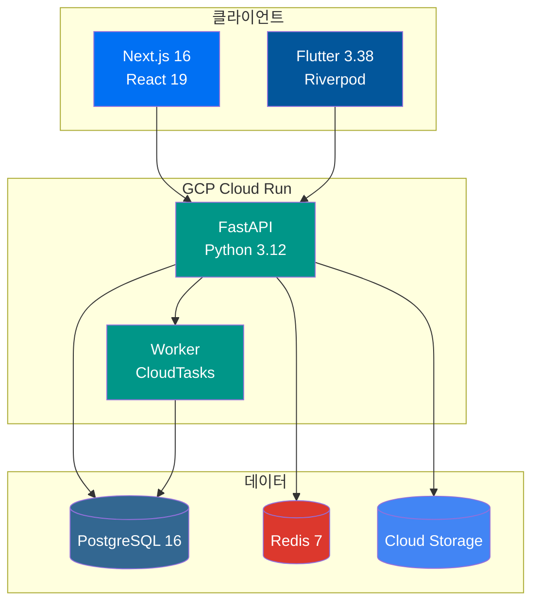

# Fullstack Starter

[](https://github.com/first-fluke/fullstack-starter/stargazers)
[](https://github.com/first-fluke/fullstack-starter)
[](https://github.com/first-fluke/fullstack-starter/releases)

[English](./README.md) | 한국어

> 템플릿 버전은 [Release Please](https://github.com/googleapis/release-please)로 관리됩니다 — [CHANGELOG.md](./CHANGELOG.md)에서 릴리즈 히스토리를 확인하세요.

실무에 바로 적용 가능한 풀스택 모노레포 템플릿입니다. Next.js 16, FastAPI, Flutter, GCP 인프라가 통합되어 있습니다.

### 3-Tier Architecture (3계층 아키텍처)



## 주요 기능

- **모던 스택**: Next.js 16 + React 19, FastAPI, Flutter 3.38, TailwindCSS v4
- **타입 안전성**: TypeScript, Pydantic, Dart 등 전 영역 타입 지원
- **통합 인증**: better-auth 기반 OAuth (Google, GitHub, Facebook)
- **국제화 (i18n)**: next-intl (웹), Flutter ARB (모바일), 공용 패키지 통합
- **API 클라이언트 자동화**: Orval (웹), swagger_parser (모바일) 코드 생성
- **IaC (Infrastructure as Code)**: Terraform + GCP (Cloud Run, SQL, Storage)
- **CI/CD**: GitHub Actions + Workload Identity Federation (키리스 배포)
- **AI 에이전트 가이드**: Gemini, Claude 등 AI 코딩 에이전트 최적화
- **mise 모노레포**: 도구 버전 통합 및 효율적인 태스크 관리

## 기술 스택

| 레이어 | 기술 |
|--------|------|
| **프론트엔드** | Next.js 16, React 19, TailwindCSS v4, shadcn/ui, TanStack Query, Jotai |
| **백엔드** | FastAPI, SQLAlchemy (async), PostgreSQL 16, Redis 7 |
| **모바일** | Flutter 3.38, Riverpod 3, go_router 17, Firebase Crashlytics, Fastlane |
| **워커** | FastAPI + CloudTasks/PubSub |
| **인프라** | Terraform, GCP (Cloud Run, Cloud SQL, Cloud Storage, CDN) |
| **CI/CD** | GitHub Actions, Workload Identity Federation |
| **도구 관리** | mise (Node, Python, Flutter, Terraform 버전 통합) |

> **[왜 이 기술 스택인가?](./docs/WHY.ko.md)** — 기술 선정 배경 상세 설명


## 사전 요구사항

- [mise](https://mise.jdx.dev/) - 런타임 버전 관리자
- [Docker](https://www.docker.com/) - 로컬 인프라 구동
- [Terraform](https://www.terraform.io/) - 클라우드 인프라 (선택 사항)

## 빠른 시작

### 1. 런타임 설치

```bash
# mise 설치 (미설치 시)
curl https://mise.run | sh

# 모든 런타임 일괄 설치 (Node 24, Python 3.12, Flutter 3, pnpm 10, uv, Terraform)
mise install
```

### 2. 의존성 설치

```bash
# 웹 의존성 (JS/TS)
cd apps/web && pnpm install

# API 의존성
cd apps/api && uv sync --frozen

# 워커 의존성
cd apps/worker && uv sync --frozen

# 모바일 의존성
cd apps/mobile && flutter pub get
```

### 3. 로컬 인프라 실행

```bash
mise infra:up
```

실행되는 서비스:
- PostgreSQL (5432)
- Redis (6379)
- MinIO (9000, 9001)

### 4. 데이터베이스 마이그레이션

```bash
mise //apps/api:migrate
```

### 5. 개발 서버 실행

```bash
# 모든 서비스 일괄 실행 (권장)
mise dev

# 개별 실행
mise //apps/api:dev    # API 서버
mise //apps/web:dev    # 웹 서버
mise //apps/worker:dev # 워커
```

## 프로젝트 구조

```
fullstack-starter/
├── apps/
│   ├── api/           # FastAPI 백엔드
│   ├── web/           # Next.js 프론트엔드
│   ├── worker/        # 백그라운드 워커
│   ├── mobile/        # Flutter 모바일 앱
│   └── infra/         # Terraform 인프라
├── packages/
│   ├── i18n/          # 공용 다국어 패키지 (Source of Truth)
│   ├── design-tokens/ # 공용 디자인 토큰 (Source of Truth)
│   └── shared/        # 공용 유틸리티
├── .agent/rules/      # AI 에이전트 가이드라인
├── .serena/           # Serena MCP 설정
└── .github/workflows/ # CI/CD
```

## 주요 명령어

### mise 모노레포 태스크

`//path:task` 문법으로 모노레포 내 특정 태스크를 실행할 수 있습니다.

```bash
# 전체 태스크 목록 확인
mise tasks --all
```

| 명령어 | 설명 |
|--------|------|
| `mise run install` | 모든 의존성 설치 |
| `mise dev` | 모든 서비스 시작 |
| `mise lint` | 전체 앱 린트 검사 |
| `mise format` | 전체 앱 코드 포맷팅 |
| `mise test` | 전체 앱 테스트 실행 |
| `mise typecheck` | 타입 체크 |
| `mise i18n:build` | 다국어 파일 빌드 |
| `mise gen:api` | OpenAPI 스키마 및 클라이언트 생성 |
| `mise infra:up` | 로컬 인프라 시작 |
| `mise infra:down` | 로컬 인프라 중지 |

### 앱별 태스크

<details>
<summary>API (apps/api)</summary>

| 명령어 | 설명 |
|--------|------|
| `mise //apps/api:install` | 의존성 설치 |
| `mise //apps/api:dev` | 개발 서버 시작 |
| `mise //apps/api:test` | 테스트 실행 |
| `mise //apps/api:lint` | 린터 실행 |
| `mise //apps/api:format` | 코드 포맷팅 |
| `mise //apps/api:typecheck` | 타입 체크 |
| `mise //apps/api:migrate` | 마이그레이션 적용 |
| `mise //apps/api:migrate:create` | 새 마이그레이션 생성 |
| `mise //apps/api:gen:openapi` | OpenAPI 스키마 생성 |
| `mise //apps/api:infra:up` | 로컬 인프라 시작 |
| `mise //apps/api:infra:down` | 로컬 인프라 중지 |

</details>

<details>
<summary>Web (apps/web)</summary>

| 명령어 | 설명 |
|--------|------|
| `mise //apps/web:install` | 의존성 설치 |
| `mise //apps/web:dev` | 개발 서버 시작 |
| `mise //apps/web:build` | 프로덕션 빌드 |
| `mise //apps/web:test` | 테스트 실행 |
| `mise //apps/web:lint` | 린터 실행 |
| `mise //apps/web:format` | 코드 포맷팅 |
| `mise //apps/web:typecheck` | 타입 체크 |
| `mise //apps/web:gen:api` | API 클라이언트 생성 |

</details>

<details>
<summary>Mobile (apps/mobile)</summary>

| 명령어 | 설명 |
|--------|------|
| `mise //apps/mobile:install` | 의존성 설치 |
| `mise //apps/mobile:dev` | 디바이스/시뮬레이터 실행 |
| `mise //apps/mobile:build` | 앱 빌드 |
| `mise //apps/mobile:test` | 테스트 실행 |
| `mise //apps/mobile:lint` | 분석기(Analyzer) 실행 |
| `mise //apps/mobile:format` | 코드 포맷팅 |
| `mise //apps/mobile:gen:l10n` | 다국어 파일 생성 |
| `mise //apps/mobile:gen:api` | API 클라이언트 생성 |

</details>

<details>
<summary>Worker (apps/worker)</summary>

| 명령어 | 설명 |
|--------|------|
| `mise //apps/worker:install` | 의존성 설치 |
| `mise //apps/worker:dev` | 워커 시작 |
| `mise //apps/worker:test` | 테스트 실행 |
| `mise //apps/worker:lint` | 린터 실행 |
| `mise //apps/worker:format` | 코드 포맷팅 |

</details>

<details>
<summary>Infrastructure (apps/infra)</summary>

| 명령어 | 설명 |
|--------|------|
| `mise //apps/infra:init` | Terraform 초기화 |
| `mise //apps/infra:plan` | 변경사항 미리보기 |
| `mise //apps/infra:apply` | 변경사항 적용 |
| `mise //apps/infra:plan:prod` | 프로덕션 미리보기 |
| `mise //apps/infra:apply:prod` | 프로덕션 적용 |

</details>

<details>
<summary>i18n (packages/i18n)</summary>

| 명령어 | 설명 |
|--------|------|
| `mise //packages/i18n:install` | 의존성 설치 |
| `mise //packages/i18n:build` | 웹/모바일용 다국어 파일 빌드 |
| `mise //packages/i18n:build:web` | 웹용 파일만 생성 |
| `mise //packages/i18n:build:mobile` | 모바일용 파일만 생성 |

</details>

<details>
<summary>디자인 토큰 (packages/design-tokens)</summary>

| 명령어 | 설명 |
|--------|------|
| `mise //packages/design-tokens:install` | 의존성 설치 |
| `mise //packages/design-tokens:build` | 웹/모바일용 토큰 생성 |
| `mise //packages/design-tokens:dev` | 개발용 워치 모드 |
| `mise //packages/design-tokens:test` | 테스트 실행 |

</details>

## 다국어 (i18n) 관리

`packages/i18n`이 다국어 리소스의 단일 기준점(SSOT)입니다.

```bash
# 다국어 파일 편집
packages/i18n/src/en.arb  # 영어 (기본)
packages/i18n/src/ko.arb  # 한국어
packages/i18n/src/ja.arb  # 일본어

# 빌드 및 배포
mise i18n:build
# 생성 파일:
# - apps/web/src/config/messages/*.json (Nested JSON)
# - apps/mobile/lib/i18n/messages/app_*.arb (Flutter ARB)
```

## 디자인 토큰 (Design Tokens)

`packages/design-tokens`는 디자인 토큰(색상, 간격 등)의 단일 기준점(SSOT)입니다.

```bash
# 토큰 편집
packages/design-tokens/src/tokens.ts

# 빌드 및 배포
mise //packages/design-tokens:build
# 생성 파일:
# - apps/web/src/app/[locale]/tokens.css (CSS 변수)
# - apps/mobile/lib/core/theme/generated_theme.dart (Flutter 테마)
```

## 환경 설정

### 환경 변수

예제 파일을 복사하여 설정합니다.

```bash
# API
cp apps/api/.env.example apps/api/.env

# Web
cp apps/web/.env.example apps/web/.env

# Infra
cp apps/infra/terraform.tfvars.example apps/infra/terraform.tfvars
```

### GitHub Actions 시크릿

리포지토리에 다음 시크릿을 등록해야 합니다.

| 시크릿 | 설명 |
|--------|------|
| `GCP_PROJECT_ID` | GCP 프로젝트 ID |
| `GCP_REGION` | GCP 리전 (예: `asia-northeast3`) |
| `WORKLOAD_IDENTITY_PROVIDER` | Terraform Output 값 |
| `GCP_SERVICE_ACCOUNT` | Terraform Output 값 |
| `FIREBASE_SERVICE_ACCOUNT_JSON` | 모바일 배포용 Firebase 서비스 계정 JSON |
| `FIREBASE_ANDROID_APP_ID` | Firebase Android 앱 ID |

### Firebase (모바일)

1. FlutterFire CLI 설치:

```bash
dart pub global activate flutterfire_cli
```

2. Firebase 설정:

```bash
cd apps/mobile
flutterfire configure
```

`lib/firebase_options.dart` 파일이 생성됩니다.

## 배포

### GitHub Actions (권장)

`main` 브랜치 푸시 시 자동 배포가 트리거됩니다.
- `apps/api/` 변경 → API 배포
- `apps/web/` 변경 → Web 배포
- `apps/worker/` 변경 → Worker 배포
- `apps/mobile/` 변경 → Firebase App Distribution 빌드/배포

### 수동 배포

```bash
# Docker 이미지 빌드/푸시
cd apps/api
docker build -t gcr.io/PROJECT_ID/api .
docker push gcr.io/PROJECT_ID/api

# Cloud Run 배포
gcloud run deploy api --image gcr.io/PROJECT_ID/api --region REGION
```

### 모바일 (Fastlane)

Fastlane을 통해 빌드 및 배포를 자동화합니다.

```bash
cd apps/mobile

# Ruby 의존성 설치
bundle install

# 주요 Lane
bundle exec fastlane android build       # APK 빌드
bundle exec fastlane android firebase    # Firebase App Distribution 배포
bundle exec fastlane android internal    # Play Store 내부 테스트 배포
bundle exec fastlane ios build           # iOS 빌드 (서명 제외)
bundle exec fastlane ios testflight_deploy  # TestFlight 배포
```

## AI 에이전트 지원

이 템플릿은 Gemini, Claude 등 AI 코딩 에이전트와의 협업을 고려해 설계되었습니다.

- `.agent/rules/`: AI 에이전트용 가이드라인
- `.serena/`: Serena MCP 설정

## 문서

- [빌드 가이드](.agent/rules/build-guide.md)
- [린트 & 포맷 가이드](.agent/rules/lint-format-guide.md)
- [테스트 가이드](.agent/rules/test-guide.md)

## 라이선스

MIT

## 스폰서

이 프로젝트가 도움이 되셨다면 커피 한 잔 부탁드립니다!

<a href="https://www.buymeacoffee.com/firstfluke" target="_blank"></a>

또는 스타(Star)를 눌러주세요:

```bash
gh api --method PUT /user/starred/first-fluke/fullstack-starter
```
