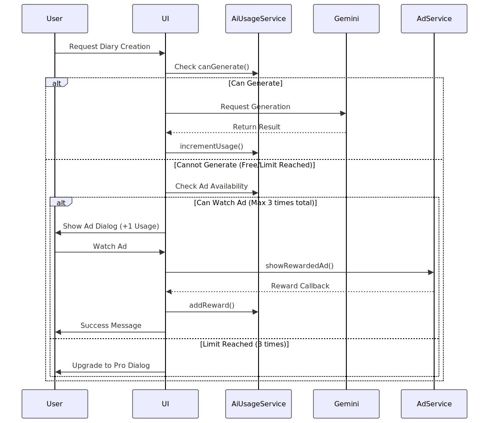

# AI 사용량 제한 및 광고 수익화 시스템 분석 보고서

## 1. 개요
사용자의 요청에 따라 무료 버전과 유료 버전의 AI 사용량 제한을 차별화하고, 무료 버전에 한해 광고 시청을 통한 추가 AI 사용 기회를 제공하는 시스템의 기술적 타당성을 분석했습니다.

### 목표
- **무료 유저**: 기본 1회/일 + 광고 시청 시 1회 추가 (최대 3회/일)
- **유료 유저**: 광고 없음 + 기본 5회/일 (기존 3회에서 상향)
- **글로벌 대응**: 국가별 광고 송출 자동화 (Google AdMob)

---

## 2. 현재 시스템 분석 (As-Is)
현재 `AiComposeScreen` 내부에 AI 사용량 제한 로직이 하드코딩되어 있습니다.

- **위치**: `apps/mobile/lib/features/ai/presentation/ai_compose_screen.dart`
- **저장 방식**: `SharedPreferences` (`ai_usage_YYYY-MM-DD`)
- **로직**:
  - `isPro` 여부 확인
  - 무료 유저일 경우 `count >= 3`이면 차단
  - 생성 성공 시 `count + 1`
- **문제점**:
  - 로직이 UI에 강하게 결합되어 있어 재사용이 어렵습니다. (예: 홈 화면에서 남은 횟수 표시 불가)
  - "광고 시청 후 보상"이라는 새로운 로직을 끼워 넣기에 복잡도가 높습니다.

---

## 3. 제안 아키텍처 (To-Be)
로직을 중앙 집중화하여 관리의 용이성을 확보합니다.

### 3.1. 서비스 분리
1.  **`AiUsageService` (신규)**
    - AI 사용량 카운트, 제한 확인, 초기화 로직 담당
    - 데이터 모델:
      - `daily_usage_count`: 오늘 사용 횟수
      - `ad_reward_count`: 광고로 획득한 추가 횟수
    - 주요 메서드:
      - `canGenerate()`: 생성 가능 여부 반환
      - `incrementUsage()`: 사용 횟수 증가
      - `addReward()`: 광고 시청 보상으로 사용 가능 횟수 증가
      - `getRemainingCount()`: 남은 횟수 반환 (UI 표시용)

2.  **`AdService` (신규)**
    - Google AdMob 초기화 및 광고 로드/표시 담당
    - 주요 메서드:
      - `loadRewardedAd()`: 보상형 광고 미리 로드
      - `showRewardedAd(onReward)`: 광고 표시 및 보상 콜백 실행

### 3.2. 데이터 흐름


---

## 4. Google AdMob 연동 및 글로벌 전략

### 4.1. 국제 광고 송출 (Global Ads)
- **Google AdMob**은 사용자의 **IP 주소와 위치 정보**를 기반으로 자동으로 해당 국가에 적합한 광고를 송출합니다.
- 개발자가 별도로 "미국용 광고", "한국용 광고"를 분기 처리할 필요가 없습니다.
- **설정**: AdMob 콘솔에서 앱을 등록하면 발급되는 `App ID`와 `Ad Unit ID`만 있으면 전 세계 어디서든 동작합니다.

### 4.2. 개인정보 보호 및 규제 대응 (GDPR/IDFA)
글로벌 서비스를 위해서는 각국의 개인정보 보호법을 준수해야 합니다.
- **EU (GDPR)**: 유럽 사용자에게는 **UMP (User Messaging Platform) SDK**를 통해 개인정보 수집 동의를 받아야 광고가 송출됩니다.
- **iOS (ATT)**: `App Tracking Transparency` 프레임워크를 통해 추적 권한을 요청해야 합니다. (`NSUserTrackingUsageDescription`)
- **해결방안**: `google_mobile_ads` 패키지와 함께 UMP SDK를 연동하면, 앱 실행 시 자동으로 사용자의 국가를 감지하여 필요한 경우 동의 팝업을 띄워줍니다.

---

## 5. 구현 상세 계획

### 5.1. 필요 라이브러리
- `google_mobile_ads`: ^5.0.0 (Flutter 공식 플러그인)

### 5.2. 설정 변경
- **Android**: `AndroidManifest.xml`에 AdMob App ID 추가
- **iOS**: `Info.plist`에 AdMob App ID 및 `SKAdNetworkItems`(광고 네트워크 ID) 추가

### 5.3. 로직 변경 (Pseudo Code)

**AiUsageService**
```dart
class AiUsageService {
  bool get isPro => _ref.read(isProProvider);

  int get maxDailyLimit {
    if (isPro) return 5;
    // 무료 기본 1회 + 광고 보상(최대 2회)
    return 1 + _adRewardCount; 
  }

  // 광고를 볼 수 있는 상태인지? (무료이면서, 오늘 3회 미만 사용 시)
  bool get canWatchAd => !isPro && _usageCount >= maxDailyLimit && _totalLimit < 3;

  Future<void> addReward() async {
    // 광고 보상으로 maxLimit을 늘리기보다는, 
    // ad_reward_count를 늘려서 maxDailyLimit 계산에 반영
    _adRewardCount++;
    save();
  }
}
```

---

## 6. 결론
- **가능 여부**: **완전 가능**. 제안하신 방식(제한으로만 컨트롤하고 광고 여부로 구분)은 매우 효율적이며 관리가 용이한 패턴입니다.
- **개발 난이도**: **중하**. AdMob 연동은 표준화되어 있으며, 기존 코드를 서비스로 분리하는 리팩토링이 주된 작업입니다.
- **추천**: 무료 유저에게 "광고를 보면 혜택을 준다"는 **보상형 광고(Rewarded Ad)** 모델은 사용자 거부감이 가장 낮은 광고 방식 중 하나로, 수익화와 사용자 경험 균형을 맞추기에 적합합니다.
